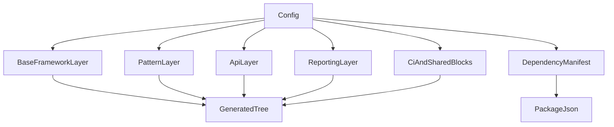

# Phase 2 — Template Composition Architecture

## Goal

Reduce the amount of framework-specific inline string assembly in the generator so Phase 2 features can be added without copying logic across `wdio`, `playwright`, and `cypress`.

## Current Pain Point

The current framework generators each build a full scaffold in one place:

- `src/generator/frameworks/wdio.ts`
- `src/generator/frameworks/playwright.ts`
- `src/generator/frameworks/cypress.ts`

That worked well for Phase 1, but it becomes harder to maintain when Phase 2 adds:

- richer API templates
- dependency compatibility groups
- framework-specific reporter caveats
- more examples and optional files

## Recommended Composition Model

Think of each generated project as the result of layered template blocks.



## Suggested Layer Types

### 1. Base framework scaffold

Owns the minimum files required for a runnable project.

Examples:

- `wdio.conf.*`
- `playwright.config.*`
- `cypress.config.*`
- base smoke test
- TS config when needed

### 2. Pattern layer

Owns `pom`, `screenplay`, and `none` output.

Examples:

- page object folders and starter files
- screenplay folder stubs
- framework-specific paths for those files

### 3. API layer

Owns transport helpers, domain helpers, and example API specs.

Examples:

- `playwright-built-in` request helpers
- WDIO `axios` or `supertest` API modules
- framework-appropriate example API tests

### 4. Reporting layer

Owns all reporter-specific config snippets and any supporting files.

Examples:

- WDIO reporter entries
- Playwright reporter array additions
- Cypress plugin and support-file guidance

### 5. Shared block layer

Owns features already implemented in `src/generator/blocks`.

Examples:

- CI files
- linting files
- dotenv files
- Zod schemas

### 6. Dependency manifest layer

Owns package groups, scripts, conflict notes, and generated install notes.

Examples:

- framework core dependency groups
- TypeScript runtime dependency groups
- reporting package groups
- API package groups
- conflict metadata for plugin-heavy combinations

This layer should remain separate from file-tree generation so dependency decisions are easy to validate before Phase 3 presets consume them.

## Recommended Module Shape

One reasonable next step is to keep one entry file per framework, but move content creation into smaller helpers:

```text
src/generator/
  frameworks/
    wdio.ts
    playwright.ts
    cypress.ts
  templates/
    base/
    pattern/
    api/
    reporting/
    dependencies/
```

The framework entry files would become orchestration layers that:

- inspect the config
- call the relevant template builders
- merge the resulting nodes

## File Ownership Rules

To avoid overlap between layers:

- only one layer should own a given generated file path
- shared blocks should continue to merge on folders, not overwrite sibling files
- the reporting layer should return config fragments or file nodes, not mutate strings in place across unrelated concerns
- the API layer should own both helper files and example specs for API mode
- the dependency layer should own package choices and notes, not generated source files

## Why This Helps Phase 2

This composition model makes future work safer:

- dependency fixes can be made without rewriting every framework generator
- Playwright API growth can happen independently from WDIO API examples
- Cypress documentation gaps can be handled in the reporting layer rather than scattered across the whole generator
- Phase 3 presets can compose tested dependency groups instead of raw package lists

## Recommended Adoption Order

1. Document the intended layer boundaries
2. Extract dependency mapping first
3. Extract API generation second
4. Extract reporting generation third

## Non-goals

Avoid over-engineering the generator into a generic plugin system in Phase 2.

The goal is better separation and readability, not a fully dynamic framework runtime.

BDD and Cucumber generation remain out of scope for Phase 2.
