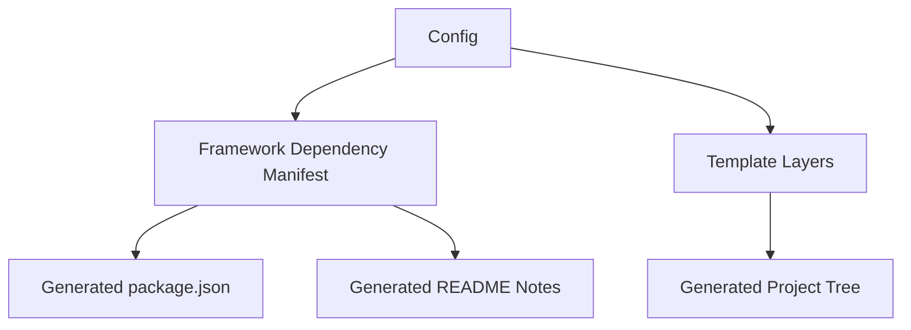

# QA Boilerplate Generator — Phase 2 Plan

## Goal

Phase 2 is a dependency-hardening phase. The generator should produce scaffolds that install cleanly, use framework-native defaults, and avoid optional integrations that are likely to create package or plugin conflicts.

The active Phase 2 direction is:

- keep `wdio`, `playwright`, and `cypress` visible in the product
- remove BDD from the active roadmap
- centralize framework dependency mapping before adding more features
- fix known framework-specific dependency risks
- keep API templates as a focused improvement area where they fit the framework

## BDD Decision

BDD is not part of Phase 2.

The product should proactively explain this instead of exposing a misleading option:

- Playwright BDD requires third-party cucumber layers that sit outside the strongest native Playwright path.
- Cypress BDD requires preprocessors and plugin wiring that can conflict with reporter integrations.
- WDIO is the only framework where Cucumber is a natural first-party-style path through `@wdio/cucumber-framework`, but adding it now would still expand scope and dependency risk.

If BDD is reconsidered later, it should be a separate WDIO-only research phase. It should not be a generic cross-framework preset or shared configuration flag.

## Current State Snapshot

The generator already supports:

- framework-specific scaffold generation for `wdio`, `playwright`, and `cypress`
- framework-specific reporter handling
- optional API templates
- CI, linting, dotenv, and Zod blocks
- downloadable ZIP output from the live preview

The current risk is not missing surface area. The risk is that dependency choices are spread across generator code and are not validated as compatibility groups.

## Phase 2 Scope

### In scope

- framework dependency mapping and compatibility rules
- central package manifest generation rules
- Playwright dependency baseline cleanup
- WDIO v9 dependency baseline cleanup
- Cypress reporter/plugin dependency cleanup
- API template improvements that do not create new dependency ambiguity
- generated documentation notes that explain install and post-install commands
- tests that lock package output for representative framework combinations

### Out of scope

- BDD implementation for any framework
- Cucumber/Gherkin generation
- runner-mode configuration
- presets, accounts, or saved projects
- VS Code extension work
- major UI redesign unrelated to dependency and template clarity
- schema-driven API code generation
- OpenAPI import workflows

## Product Direction

Phase 2 keeps the same product promise: generate a usable QA starter project quickly. The internal change is that dependencies become explicit product data instead of scattered strings.



## Dependency Manifest Direction

Add a central dependency map before expanding generated files further.

```ts
type DependencyGroup = {
  packages: Record<string, string>
  scripts?: Record<string, string>
  notes?: string[]
  conflictsWith?: string[]
}

type FrameworkDependencyManifest = {
  core: DependencyGroup
  typescript?: DependencyGroup
  reporting?: Record<string, DependencyGroup>
  api?: Record<string, DependencyGroup>
  linting?: DependencyGroup
}
```

Rules:

- keep each framework's core package family aligned
- prefer built-in reporters before adding reporter packages
- add plugin conflict notes where a framework uses event hooks
- keep TypeScript runtime tooling framework-appropriate
- do not add transitive dependencies manually unless the integration requires direct imports
- use generated tests to verify package groups, not only individual package names

## Framework Positioning

### WebdriverIO

WDIO should be updated for the v9 ecosystem.

Phase 2 should:

- keep WDIO on a consistent `@wdio/*` version family
- replace stale TypeScript runtime assumptions with the current `tsx` direction
- keep Mocha as the generated default
- document that Cucumber is intentionally deferred, not forgotten
- keep API helpers based on explicit `axios` or `supertest` choices

### Playwright

Playwright should stay native-first.

Phase 2 should:

- keep `@playwright/test` as the only required core dependency
- prefer the built-in HTML reporter over extra HTML reporter packages
- use `allure-playwright` only when Allure is selected
- treat `playwright-built-in` as the preferred API testing path
- document the browser install step clearly

### Cypress

Cypress should be supported, but with stricter plugin discipline.

Phase 2 should:

- keep `cypress` as the core dependency
- prefer `allure-cypress` for Allure instead of older plugin wiring
- keep `cypress-mochawesome-reporter` for HTML reporting
- add `cypress-on-fix` only when multiple plugins need overlapping Cypress event hooks
- avoid BDD preprocessors entirely

## Documentation Deliverables

Phase 2 documentation ships as:

1. this scope document
2. a Phase 2 ticket breakdown
3. a dependency mapping reference
4. an API template strategy note
5. a template-composition architecture note

## Parallel Workstreams

Once the scope above is accepted, the following work can run in parallel:

- dependency manifest design
- WDIO v9 dependency cleanup
- Cypress reporter/plugin cleanup
- Playwright API template expansion
- package output regression tests
- generated README/install-note updates

## Success Criteria

Phase 2 is complete when:

- BDD is removed from active implementation scope
- dependency mapping lives in one documented model
- generated `package.json` output is covered by framework-specific tests
- Playwright, WDIO, and Cypress scaffolds use current dependency guidance
- preset work can consume stable dependency groups in Phase 3
